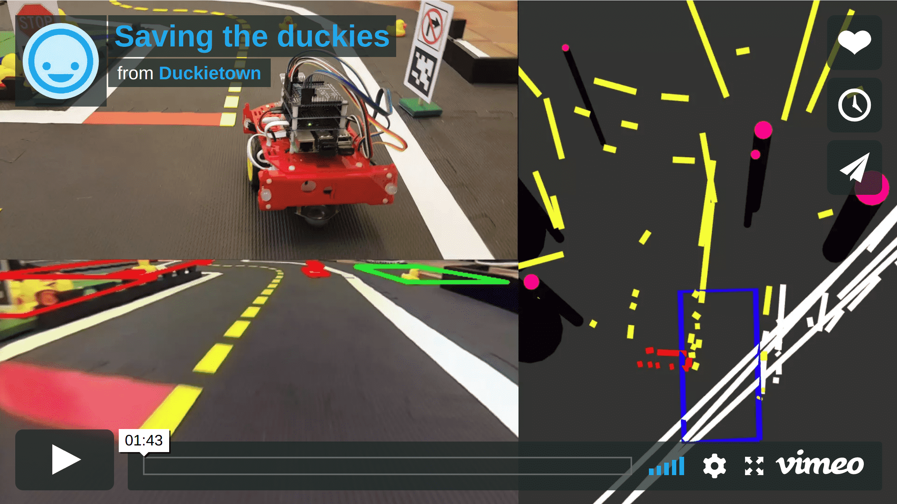

# Package `obst_avoid` {#obst_avoid}

---

This is a package which was generated throughout the fall semester 2017 at ETH Zurich and implements an obstacle detection and avoidance behaviour, whereas the obstacles are namely yellow duckies and orange cones. The structure of the readme is as follows: 

For simply getting the code to run you have to follow the instructions given in the first two sections (Prerequisites and Standart code usage). Which is followed by a video which shows the Expected Outcome.

If the instructions in the first two sections do not work properly, you can find answers on how to resolve potential and well known conflicts in the third section (Troubleshooting)

If you want to understand the whole package more thoroughly and eventually use it as a basis for improvements, feel free to read the last section of this Readme (Thorough code and package description) which gives more detail on all the functionality provided by the package. 

---

## PREREQUISITES

In order to being able to use the package it is necessary to install AN ADDITIONAL LIBRARY:

`duckiebot $ pip install scikit-image`

---

## CODE USAGE

### Step1: 
On the duckiebot: Navigate to `DUCKIETOWN_ROOT`

```
duckiebot $ source environment.sh 
duckiebot $ make demo-lane-following
```

Wait for a couple of seconds until everything has been properly launched

### Step2: 
Open a second terminal on the duckiebot and run:

`roslaunch obst_avoid obst_avoid_lane_follow_light.launch veh:=robot_name`

### Step3: 
press x ON YOUR JOYSTICK to generate an anti-instagram transformation 

Within about the next 10 seconds in the terminal of Step2 this **YELLOW** message should appear:

`!!!!!!!!!!!!!!!!!!!!TRAFO WAS COMPUTED SO WE ARE READY TO GO!!!!!!!!!!!!`

**If this was not the case, step 3 MUST BE REPEATED UNTIL THIS MESSAGE IS GENERATED!** :bangbang:

### Step4: 
Step4 is **not mandatory** but might help You to figure out potential errors and to visualize what is going on. Furthermore it is highly recommended to run the visualisation on the laptop, to keep the computing power on the raspberry pi on a minimum. To visualize the outputs follow these commands:

```
laptop $ source set_ros_master.sh robot_name
laptop $ roslaunch obst_avoid obst_avoid_visual.launch veh:=robot_name
laptop $ rviz
```

The topics of interest are:

`/robot_name/obst_detect_visual/visualize_obstacles` (Markers which show obstacles, visualize via rviz!)
`/robot_name/obst_detect_visual/image/compressed` (Image with obstacle detection overlay, visualize via rqt!)
`/robot_name/obst_detect_visual/bb_linelist` (bounding box of obstacle detection visualize via rqt!)
`/robot_name/duckiebot_visualizer/segment_list_markers` (line segments)

### Step5: 
To let your duckiebot drive, press R1 to start the lane following. The Duckiebot stops if obstacles are detected and in reach of the duckiebot. Removal of the obstacle should lead to the continuation of the lane following.

---

## EXPECTED OUTCOME

[](https://player.vimeo.com/video/251523150 "The Saviors Teaser - Click to Watch!")

---

## TROUBLESHOOTING

### Nothing works at all

Propably You did not build Your workspace yet, so on your duckiebot run:
```
duckiebot $ source environment.sh 
duckiebot $ catkin_make -C catkin_ws/
```

### Yellow message is not printed

The first step to find out why the Yellow message is not printed after having executed Step3 for several times is to check whether any node of anti_instagram is running at all. Do this by executing the following commands in a new terminal on your laptop:

```
laptop $ source set_ros_master.sh robot_name
laptop $ rostopic list
```

**VAR1: The topic `/robot_name/anti_instagram_node/transform` is not listed there:**

The solution to this problem is to ensure that the anti-instagram node is launched which will publish a linear color transform under a topic `/robot_name/anti_instagram_node_name/transform`

If this topic is named different to `/robot_name/anti_instagram_node/transform` then you have to adapt it in the package [`anti_instagram`](#anti_instagram) in the image_transformer_node.py in line 51.

**VAR2: The topic `/robot_name/anti_instagram_node/transform` is listed but the yellow message does not appear**

You should move the duckiebot to another position on the map or to another place in general and try again.

If this does not help, check out if there is anything published on this topic at all via:

`laptop $ rostopic echo /robot_name/anti_instagram_node/transform`

If there is nothing published checkout the anti_instagram readme on how to resolve this problem.

### Steps1-5 work but the detection is not working reliably

This means that in general the software is working correctly but that for instance further parameter tuning might be necessary. In the following some parameters will be provided which You are able to tune fastly. To understand the full meaning of all of them and even more possible changes, You might want to read the follwing section (Thorough code and package description)

THE FOLLOWING PARAMS ARE ALL TO BE CHANGED IN **DETECTOR.PY** if not stated other:

* the number of pixels from when an object is considered for evaluation is adaptive towards the homography but if you want to change them by a factor, you can do that by adapting **self.obst_thres**. E.g. if You increase this value, only larger elements will be considered as obstacles, so this parameter has to be adapted with respect to the obstacles you want to detect. However, in the current implementation all sizes of duckies should be detected.
* if you feel that you have smaller elements that should be detected you can also play around with the value **self.major_intertia_thres** which has impact in the object_filter function. Especially if you want to detect very little duckies you might want to change the criteria to 10 . But we do not recommend to make it lower than 10 because usually lines have an inertia_tensor_eigenval of right below 10,...
* if some obstacles are not detected reliably during dynamic driving but very reliably in a static scene, the reason can be that they cannot be tracked amongst enough consecutive frames. To add all objects which are considered as obstacles as fast as possible you might set **self.min_consec_tracking** to 1
* if you want to make the tracker a little more restrictive, the two parameters to play with are on the one hand the **y_distance** and on the other hand the **self.minimum_tracking_distance**
* if only obstacles in your vicinity (meaning very very close to you) are detected you might on the one hand check your extrinsic calibration or if you want to have a fast debug, just change the reference world point in meters via the parameter **self.ref_world_point_x**. Whether your changes had an effect can be checked via executing Step4 of the starting procedure on your laptop and checking the output of the topic `/robot_name/obst_detect_visual/image/compressed` in rqt.
* if you might want to run or actually can run your algorithm at more than our 2-3Hz then you have to adapt the rate in the obstacle_detection_node.py **(not the detector.py)** (Important additional node: Since we are also trying to run a kind of obstacle tracking to make everything more robust you might want to adapt the parameters linked to this tracking, which is mainly **self.min_consec_tracking** 

---

## THOROUGH CODE AND PACKAGE DESCRIPTION

In case, You want to further understand our code and in general the whole package and multiple launching options, then You can read all the additional information below!!! *However, for "regular" users who just want to start our package this is not necessary!*

### General file overview

---

### obstacle_detection_node
In this node we perform the general obstacle detection. Therefore the main input are the raw image data, namely `'/robot_name/image_transformer_node/corrected_image` if the anti_instagram is running **(which is the highly recommended configuration!)** or `/robot_name/camera_node/image/compressed`. 

THE MAIN OUTPUT OF THIS NODE IS THE TOPIC:

`/robot_name/obst_detect/posearray`

This pose array contains an array of all of the detected obstacles, where:
- *position.x* represents the real WORLD x coordinate of the obstacle
- *position.y* represents the real WORLD y coordinate of the obstacle
- *position.z* represents the real WORLD RADIUS of the obstacle (is negative if obstacle behind LANE BOUNDARY)
- *orientation.x* represents the "most" left pixel of the obstacle in bird view
- *orientation.y* represents the "most" top pixel of the obstacle in bird view
- *orientation.z* represents the "most" right pixel of the obstacle in bird view
- *orientation.w* represents the "most" bottom pixel of the obstacle in bird view

### launch file options for the obstacle_detection_node
*Our current recommended launching option is described above (Step1-Step5)!!!*. However there are two alternative launching options available which are explained in the following:

#### VAR1:
```
roslaunch obst_avoid obst_avoid.launch veh:=YOUR_ROBOT_NAME_GOES_HERE (default="dori") show_marker:= (default=false) show_image:= (default=false) use_ai:= (default=true) ai_interval:= (default=10)
```

*This launchfile will launch our obstacle detection node together with the continuous anti-instagram node. However, in the final project file we did not use this option, as the continouus anti-instagram node was at that time too computationally expensive, even if we set the ai_interval parameter to very high values e.g. 100 which means that a transformation is only calculated every 100 seconds* 

example without visualizing anything: 

```
roslaunch obst_avoid obst_avoid.launch veh:=arki
```

example with visualizing the obstacles in the imageframe: 

```
roslaunch obst_avoid obst_avoid.launch veh:=arki show_image:=true
```

> NOTE: although this node is not meant for visualization but rather for fast execution you can still visualize the obstacles with those two parameters if you want to and since the obstacle detection algorithm is performing on a cropped version of the image, here if you turn on show_image, this cropped version is displayed. So the visualisation properties in this node are for making development easy but throughout normal operation we recommend to use the instructions given in Step1 to Step5

#### VAR2:
```
roslaunch obst_avoid obst_avoid_only.launch veh:=YOUR_ROBOT_NAME_GOES_HERE (default="dori") show_marker:= (default=false) show_image:= (default=false) use_ai:= (default=false)
```

With this launch file we will subscribe to the raw image so anti_instagram is not needed at all! In terms of computational effort this is the best implementation but as the color's hsv values change a lot under different lighting conditions the obstacle detection will only perform poorly and so we do not recommend to use this implementation.

***

### obstacle_avoidance_node
In the obstacle avoidance node we react to the obstacle detecte from the obstacle detection node. 
The main inputs to this node are `/robot_name/obst_detect/posearray` and `/robot_name/lane_filter_node/lane_pose/`.

The main outputs of this node are the following:

`/robot_name/obstacle_avoidance_active_flag` (Flag indicating that the obstacle avoidance is active)
`/robot_name/obst_avoid/obstacle_avoidance_pose` (Pose array which contains the d_ref and v_ref used by the lane controller node)

To check the functionality of this node one should look at the obstacle avoidance flag and the two other outputs of the node. If the flag is not going true if there is an obstacle in front of the obstacle something is wrong with with the detection or the size of the bounding box. The flag going true, and the obstacle_avoidance_pose values changing without the robot reacting indicate issues with the lane controller node. 

### launch file options for obstacle_avoidance_node
The node gets launched when the `obst_avoid.launch` or the `obst_avoid_lane_follow_light.launch` files are executed. 
```
roslaunch obst_avoid obst_avoid.launch veh:=YOUR_ROBOT_NAME_GOES_HERE bb_len:= (default=500) bb_wid:= (default=250)
```
With the parameters **bb_len** and **bb_wid** you can define the length and width of the obstacle avoidance bounding box. This can help during debugging and tuning of the detection.

***

### obstacle_detection_node_visual
In this node we visualize the output of our obstacle_detection_node. This node is meant to be run on your personal laptop for verifying what is going on during the drive!!!

Therefore the main input to the visualizer is the topic `/robot_name/obst_detect/posearray` and maybe (if you also choose to visualize the image including the obstacles in a bounding box) `/robot_name/camera_node/image/compressed`.

The main outputs are the following:

`/robot_name/obst_detect_visual/visualize_obstacles` (Markers which show obstacles, visualize via rviz!)
`/robot_name/obst_detect_visual/image/compressed` (Image with obstacle detection overlay, visualize via rqt)
`/robot_name/obst_detect_visual/bb_linelist` (bounding box of obstacle detection visualize via rqt)
`/robot_name/duckiebot_visualizer/segment_list_markers` (line segments)

Sometimes the output, especially the visual output that you see from rqt might be really laggy. There are two explanations to this phenomen. Firstly, the slow wifi transmitter from the duckiebot generates a considerable lag. If we connected our duckiebot and Laptop directly via an Ethernet cable the visual rqt output was by far more reliable. And the other thing is that the obstacle_detection_node_visual also has to align the raw images with the corresponding posearray at the right timestamp which is also a potential point where something might go wrong.

### launch file options for obstacle_detection_node_visual
For the obstacle_detection_node_visual there is only one launch option:
```
roslaunch obst_avoid obst_avoid_visual.launch veh:=YOUR_ROBOT_NAME_GOES_HERE (default="dori") show_marker:= (default=true) show_image:= (default=true)`
```
With the parameters **show_marker** and **show_image** you can define which of the topics mentioned above will be published.
e.g. if you use:
``` 
roslaunch obst_avoid obst_avoid_visual.launch veh:=YOUR_ROBOT_NAME_GOES_HERE show_marker:=true show_image:=false
```
then only `/robot_name/obst_detect_visual/visualize_obstacles` will be published. This launch file is again the most efficient one since the synchronizing part in the obstacle_detection_node_visual is not needed.

***

### scripts

We have created a bunch of useful scripts in order to debug, tryout new things and variations to our detection algorithm offline on your PC. They are all not made to be run on the bot! They can be all found in `../obst_avoid/scripts/`. Two of them help to create the images which can then be used to adapt and evaluate our code efficiently. Let us show how you can make use of them step by step.

Assuming that you have got collected a bag including the raw camera images. 
Then you can use the **launch file create_bag.launch** which will in return create a new bag which will only contain the corrected image from the anti instagram module. This is done by playing the bag and launching the continouus anti-instagram node in parallel. Use this file as follows:

```
roslaunch obst_avoid create_bag.launch veh:=dori path_save:=/home/niggi/Desktop/1.bag path_play:=/home/niggi/Desktop/bags/Record6/dori_slow_and_full_2017-12-11-14-09-28.bag
```

* *path_play* specifies the path to the bag file which should be played
* *path_save* specifies the path to the bag where it should be saved
* *veh* specifies the name of the vehicle with which the log was taken

After having created this bag containing the corrected images (or you might also already have a bag with the topic `/robot_name/image_transformer_node/corrected_image`, we have to **extract them by using the script dt-bag-image-extract**. 
This can be used by first going into the file .../duckietown/catkin_ws/src/25-devel-saviors/obst_avoid/scripts and typing e.g.
```
./dt-bag-image-extract /home/niggi/Desktop/1.bag /dori/image_transformer_node/corrected_image /home/niggi/Desktop/1_pics
```

* where the first argument is the path to the previously created bagfile 
* the second argument is the topic of interest which we want to transform into an image 
* the third argument is the path to a directory which will be created in order to store the pictures in it!

Now, that we have all the pictures we can finally tune our code using two additional files. 
The first one, **the jupyter notebook file, color_thresholds** lets you load some image and shows what would have been detected as yellow, white and orange.`This file in general is very useful to get a rough impression on what is going on in our algorithm. If also at one point in time the groundtruth values of the anti_instagram might change or the anti_instagram_node might behave differently this script will be very good suited to find out the new color threshold values which can then be adapted in the detector.py file. This script is also very useful if you want to tryout new obstacle detection approaches. 

**The second file, dt-detector_eval.py** lets you evaluate the overall perfomance of your current implementation of the obstacle_detection_node by loading all of the previously created pictures (with the *dt-bag-image-extract* file), applying the detector on them, drawing bounding boxes around the detected objects and storing the finally created pictures in a dedicated path! Since this **dt-detector_eval** file is meant to being able to evaluate the performance of the detector it also only outputs the cropped version of the pictures, so with this programme, you are also able to check whether the incoming pictures are actually cropped at a reasonable height. Sample usage:

start a roscore in a first terminal:

`roscore`

in a second terminal, naviagte into the path `.../obst_avoid/scripts/` and type e.g.:

```
./dt-detector_eval.py ~/Desktop/19.12.6_pics/ ~/Desktop/19.12.6_pics/editted/
```

* where the **first argument** is the path where your previously created pictures are
* the **second argmunent** describes the directory where the edited pictures which are cropped and include the bounding boxes are stored!

A third script is provided which can be used to decode an .csv file of thehive.ai.

## CONTRIBUTORS

Julian Nubert - nubertj@ethz.ch

Fabio Meier - fmeier@ethz.ch

Fabrice Oehler - foehler@ethz.ch

Niklas Funk - nfunk@ethz.ch


<move-here src='#pkg_name-autogenerated'/>
